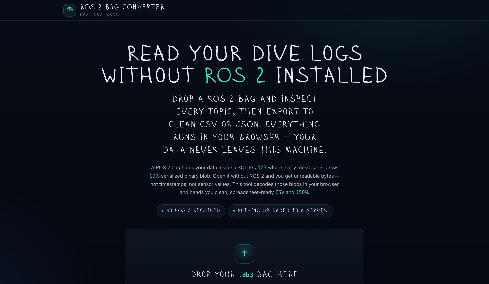

# ROS 2 Bag Converter

Inspect ROS 2 bag (`.db3`) files and export topics to clean **CSV** and **JSON** — entirely in your browser. No ROS 2 installation, no backend, nothing uploaded to a server.

**🔗 Live demo: [wuisabel-gif.github.io/ros2bag_converter](https://wuisabel-gif.github.io/ros2bag_converter/)**

A ROS 2 bag hides your data inside a SQLite `.db3` where every message is a raw, CDR-serialized binary blob. Open it without ROS 2 and you get unreadable bytes — not timestamps, not sensor values. This tool decodes those blobs locally and hands you spreadsheet-ready CSV and JSON.



## Demo

[](https://youtu.be/Ah4hHxRI_uk)

▶️ **[Watch the demo on YouTube](https://youtu.be/Ah4hHxRI_uk)** — load a bag, inspect topics, and export CSV/JSON.

## Features

- **Bag summary** — topics, message counts, message types, start/end time, duration, and storage info (like `ros2 bag info`).
- **Timeline view** — `rqt_bag`-style message-density lanes per topic, so dropouts and recording gaps are obvious at a glance. Includes a per-topic publish rate (Hz).
- **Topic explorer** — filter, select one/many/all topics, and expand any row to preview decoded messages.
- **Inline visualizations** — when you expand a topic:
  - **Trajectory** (top-down X/Y plot) for `Odometry` / `PoseStamped`
  - **Transform tree** for `tf2_msgs/TFMessage`
  - **3D point cloud preview** for `sensor_msgs/PointCloud2`
- **CSV export** — nested fields flattened into consistent columns (e.g. `angular_velocity.x`, `orientation_covariance.0`). Timestamps preserved as seconds.
- **JSON export** — full nested message structure preserved, including arrays.
- **Robust** — unknown message types export as raw byte summaries instead of crashing; corrupted/non-rosbag files produce clear errors.

## Usage

1. Open the app — the [live site](https://wuisabel-gif.github.io/ros2bag_converter/) or `index.html` locally.
2. Drag and drop your `.db3` bag onto the page — optionally include `metadata.yaml`.
3. Review the summary, timeline, and topic list.
4. Select the topics you want and click **Download CSV** or **Download JSON**.

Everything happens client-side. Your bag never leaves your machine.

## Command-line tools

[](cli/node)
[](cli/python)
[](LICENSE)

Prefer the terminal or need to script exports? The [`cli/`](cli/) folder has matching
command-line versions — **Node.js** (`npm`) and **Python** (`pip`) — that share the same
CDR decoder and built-in schemas as this web app:

```bash
ros2bag-convert info my_bag.db3                  # summary, like `ros2 bag info`
ros2bag-convert my_bag.db3 -f csv -t /odom -o odom.csv
ros2bag-convert my_bag.db3 -f json > all_topics.json
```

See [`cli/README.md`](cli/README.md) for install and usage.

## Supported message types

Built-in schemas decode the common ROS 2 messages out of the box:

`sensor_msgs/Imu`, `sensor_msgs/PointCloud2`, `sensor_msgs/Image`, `sensor_msgs/CompressedImage`, `sensor_msgs/Range`, `sensor_msgs/Temperature`, `sensor_msgs/FluidPressure`, `sensor_msgs/MagneticField`, `sensor_msgs/NavSatFix`, `sensor_msgs/LaserScan`, `sensor_msgs/JointState`, `sensor_msgs/BatteryState`, `nav_msgs/Odometry`, `nav_msgs/Path`, `geometry_msgs/*` (Pose, Twist, Transform, Vector3, Quaternion, …), `tf2_msgs/TFMessage`, and all `std_msgs/*`.

For bags recorded with ROS 2 **Iron** and newer, the converter also reads the bag's own `message_definitions` table and decodes **arbitrary custom message types** automatically. Targets ROS 2 **Humble**, **Iron**, and **Jazzy**.

## How it works

- [**sql.js**](https://sql.js.org/) (SQLite compiled to WebAssembly) reads the `.db3` directly in the browser.
- A hand-written **CDR deserializer** decodes the binary message blobs (correct little/big-endian handling and field alignment).
- A schema registry combines built-in definitions with any definitions embedded in the bag.

The entire app is a single `index.html` (the display font is embedded), so it deploys anywhere static files are served.

## Deployment

### GitHub Pages

1. Commit `index.html` to a repository.
2. Go to **Settings → Pages → Build and deployment**.
3. Set **Source** to *Deploy from a branch*, pick your branch, folder `/ (root)`.
4. Your site goes live at `https://<username>.github.io/<repo>/`.

### Local

Just open `index.html` in a browser, or serve the folder:

```bash
python3 -m http.server 8000
# then visit http://localhost:8000
```

An internet connection is required at runtime to load the WebAssembly SQLite engine from a CDN.

## Limitations

- The whole `.db3` is loaded into memory by the SQLite engine, so very large bags (≳ several hundred MB) are best handled on a desktop browser.
- Large binary arrays (point-cloud and image `data`) are summarized in exports to keep file sizes usable.

## License

Licensed under the [Apache License 2.0](LICENSE).

© 2026 [Isabel Wu](https://github.com/wuisabel-gif)
